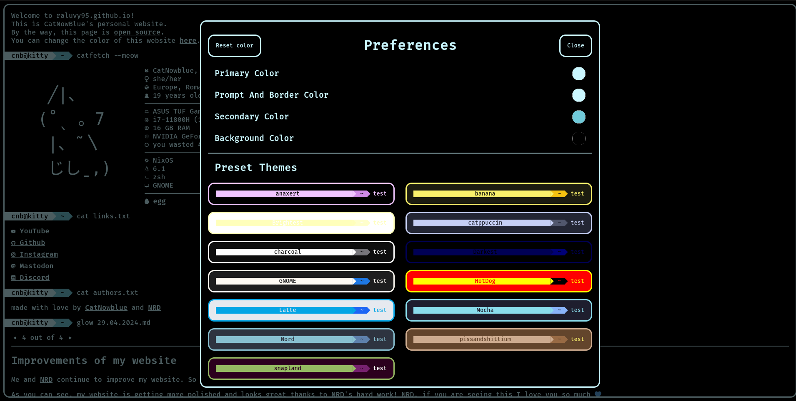
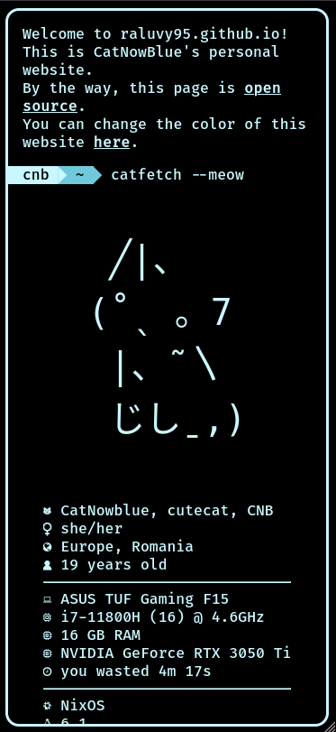

# raluvy95.github.io - [DEMO](https://raluvy95.github.io)

Personal page with customizable color. Includes blogging and responsible.

### Overview

Desktop

Overview

Preferences

Mobile

the first line of every blog markdown file will be the filename. blogs should be named after their index (0.md, 1.md etc)