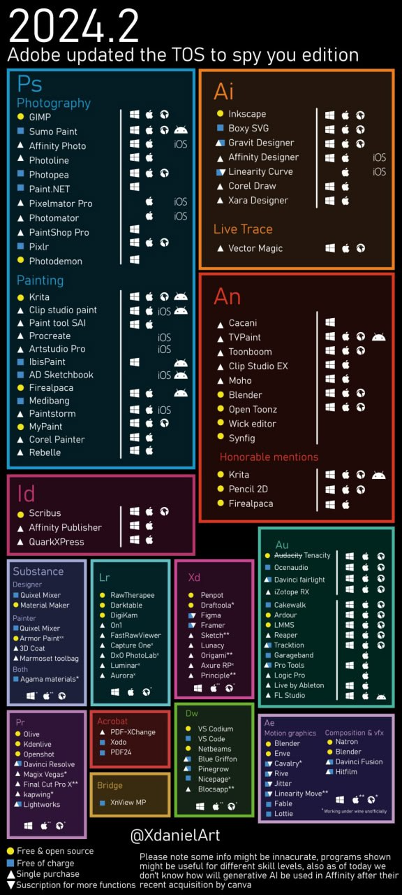

9.06.2024

# Alternatives for Adobe products
TL;DR - Just switch to GIMP, Krita or Photopea if you are using Photoshop (the most popular software).

Adobe decided to crack down its customers with new TOS which customers has no chance but to accept in order to continue using their services. [The new TOS allows Adobe](https://nichegamer.com/photoshop-terms-of-service-grants-adobe-access-to-user-projects-for-content-moderation/) [to spy on their customers and to train their AI and content moderation](https://www.theverge.com/2024/6/7/24173838/adobe-tos-update-firefly-generative-ai-trust). There is no reason to continue using Adobe's software.

🏴‍☠️

    It is always morally correct to pirate Adobe software.
      
    Remember if they steal from you, you are morally obligated to pirate their software

